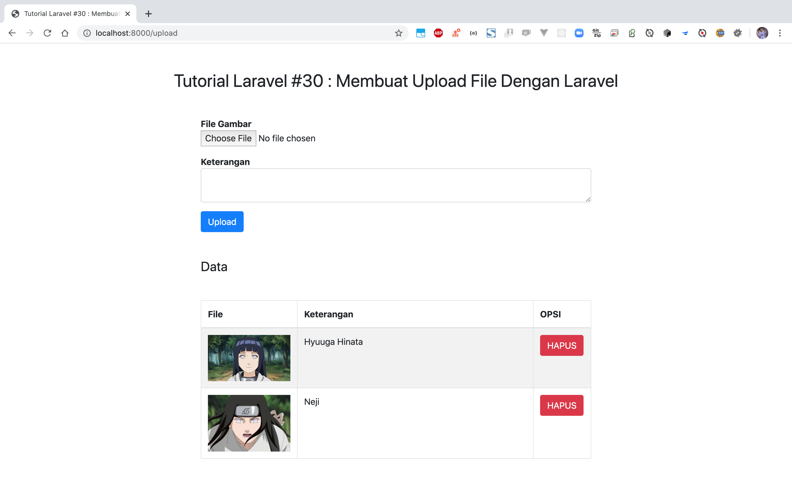

# Laravel CRUD APP

### Things to do list:
1. Clone this repository: `https://github.com/hendisantika/laravel7_upload.git`
2. Go inside the folder: `cd laravel7_upload`
3. Run `cp .env.example .env` & set your desired db name
4. Run `composer install` 
5. Run `php artisan migrate`
6. Run `npm install && npm run dev`
7. Run `php artisan serve`

Open your favorite browser: http://localhost:8000/upload

### Screen shot

Upload File

